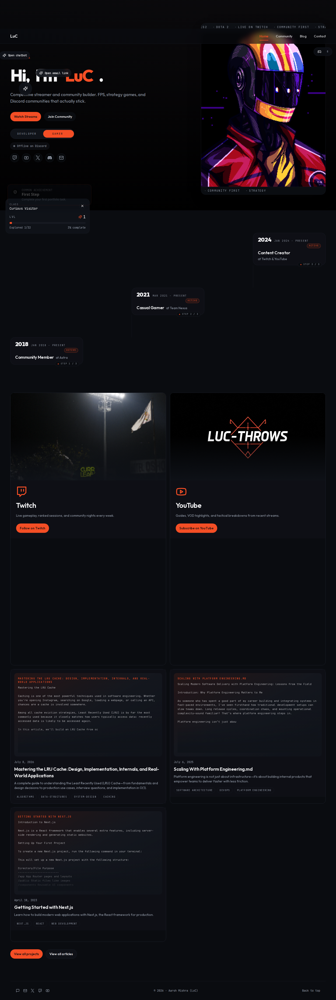

# LuC's Portfolio

A modern, responsive portfolio website built with Next.js, TypeScript, and Tailwind CSS. The site uses a dual persona concept so visitors can switch between developer and gamer profiles with distinct styling, navigation, and content.




> Regenerate these stills any time with `npm run capture:snapshots` (writes `public/ss1.png`, `public/ss2.png`, and the `public/portfolioSS.png` project-card thumbnail).

## Features

- 🌓 Dual persona toggle (Developer/Gamer) that reroutes home content, navigation, blog filters, and accent language without a page reload
- 🎬 Cinematic hero intro overlay on each fresh page load/reload (portal-mounted so it sits above the game HUD stacking context)
- 📜 Center-spine zigzag experience timeline with directional slide-in reveal and a milestone dot on the spine
- 🎞️ Seamless kinetic marquee of tech / games (two duplicated halves + `w-max` track for a gapless loop)
- 🧩 Persona-aware featured bento: developer persona interleaves projects and blog posts across six cells; gamer persona swaps to Twitch/YouTube cards + gamer blogs
- 🕹️ Gamer HUD: achievements, class card, floating hints, focus toggle, live Discord status, and Spotify activity card
- 🎨 Dark theme with persona-specific accent variables
- 📱 Responsive App Router pages for home, blog, projects, contact, and community
- 📝 Markdown content for blogs, projects, work experience, gaming experience, and the home-page marquee strings
- 🤖 Gemini-powered portfolio chatbot and blog TL;DR summaries
- 📬 Contact form delivery through Telegram
- 🔎 Persona-aware blog filtering, keyword search, SEO metadata, structured data, and sitemap routes
- 🎥 Reproducible demo pipeline (`npm run record:demo`) that produces a testreel MP4 + screenshot step log

## Tech Stack

- **Framework**: [Next.js 15](https://nextjs.org/) App Router with [React 19](https://react.dev/)
- **Language**: [TypeScript](https://www.typescriptlang.org/)
- **Styling**: [Tailwind CSS](https://tailwindcss.com/) and [shadcn/ui](https://ui.shadcn.com/)
- **Animation/3D**: [Framer Motion](https://www.framer.com/motion/) and [Three.js](https://threejs.org/)
- **Icons**: [Lucide Icons](https://lucide.dev/) and React Icons
- **Content**: Markdown/MDX files parsed with [gray-matter](https://github.com/jonschlinkert/gray-matter), `unified`, `remark`, and `rehype`
- **AI**: [`@google/genai`](https://www.npmjs.com/package/@google/genai) using Gemini 2.5 Flash
- **Operational integrations**: Telegram Bot API for contact messages, Vercel Analytics, and Discord Lanyard status

## Getting Started

### Prerequisites

- Node.js 20 or later (`@google/genai` requires Node 20+)
- npm

### Installation

1. Clone the repository:

```bash
git clone https://github.com/LuC-9/custom-portfolio.git
cd custom-portfolio
```

2. Install dependencies:

```bash
npm install
```

3. Create local environment variables:

```bash
cp .env.example .env.local
```

Fill only the values you need for local testing. The site still runs without AI or Telegram credentials, but the chatbot and AI summary widgets are hidden when Gemini is not configured.

4. Run the development server:

```bash
npm run dev
```

5. Open [http://localhost:3000](http://localhost:3000) in your browser.

## Demo

A production walkthrough of the site ships with the repo:

- **Video**: `demo/portfolio-demo.mp4` (tracked via Git LFS)
- **Screenshot step log**: `demo/steps/*.png` for each captured beat (intro cinematic, persona flip, kinetic marquee, experience timeline, featured work, blog, mobile view)

Regenerate both artifacts locally:

```bash
npm run record:demo
```

The script runs a fresh production build and drives the `testreel` walkthrough against the running app. Global one-time setup is documented in [AGENTS.md](AGENTS.md).

## Environment Variables

| Variable | Required for | Notes |
| --- | --- | --- |
| `GEMINI_API_KEY` | Chatbot and AI blog summaries | `next.config.mjs` exposes this as `NEXT_PUBLIC_GEMINI_API_KEY` for browser-side Gemini calls. Treat it as public to site visitors. |
| `TELEGRAM_BOT_TOKEN` | Contact form and chatbot contact tool | Used by `app/api/contact/route.ts` to call Telegram's `sendMessage` API. |
| `TELEGRAM_CHAT_ID` | Contact form and chatbot contact tool | Destination chat for Telegram contact submissions. |
| `APP_URL` | Hosting/platform metadata | Present in `.env.example`; not required for the active chatbot or contact route. |

There is no active `DISCORD_WEBHOOK_URL` contact path. Contact submissions use Telegram.

## Project Structure

```text
├── app/                         # Next.js App Router pages, API routes, metadata, and sitemaps
│   ├── api/contact/             # Telegram-backed contact endpoint
│   ├── api/portfolio-context/   # JSON context consumed by the chatbot
│   ├── blog/                    # Blog listing, detail pages, audio summary wrapper
│   ├── community/               # Gamer/community page
│   ├── contact/                 # Contact page
│   ├── projects/                # Project listing page
│   └── sitemap*/                # Sitemap index and route handlers
├── components/                  # Reusable UI, chatbot, summaries, persona sections, search
│   ├── intro/                   # Hero intro cinematic overlay (portal-mounted)
│   ├── game/                    # Gamer HUD: achievements, class card, floating hints, focus toggle
│   ├── home-marquee-client.tsx  # Seamless kinetic marquee client
│   └── home-experience-section.tsx  # Zigzag center-spine timeline
├── contexts/                    # Persona context provider
├── content/                     # Markdown content loaded by lib/content.ts
│   ├── blog/
│   ├── experience/
│   ├── gaming-experience/
│   ├── home/                    # Home-page marquee sources (skills, games)
│   └── projects/
├── hooks/                       # Client hooks (use-intro-gate, use-floating-hint, use-reduced-motion)
├── lib/                         # Content, Telegram, and utility helpers
│   └── content/                 # Small typed loaders for home marquee content
├── public/                      # Static assets
├── demo/                        # Demo pipeline output (MP4 via Git LFS, screenshot step log)
├── app/globals.css              # Global styles and theme variables
└── tailwind.config.ts           # Tailwind and theme configuration
```

## Content Management

`lib/content.ts` is the source of truth for loading content. It reads Markdown/MDX from `content/<type>/`, parses frontmatter with `gray-matter`, renders Markdown to HTML, calculates reading time, and sorts content by `order`, then `date`, then `title` where available.

### Adding Blog Posts

Create a Markdown file in `content/blog/`:

```markdown
---
title: "Your Blog Post Title"
excerpt: "A brief summary of your blog post"
date: "YYYY-MM-DD"
tags: ["Next.js", "React"]
featured: true
audioSummary: "/optional-audio-file.wav"
image: "/optional-image.jpg"
---

Your blog post content in Markdown...
```

Blog search matches title, excerpt, and tags. Persona filtering is tag-based: posts with tags containing `gaming`, `streaming`, `twitch`, `youtube`, `esports`, `games`, or `game` appear in the Gamer filter; other posts appear in the Developer filter.

### Adding Projects

Create a Markdown file in `content/projects/`:

```markdown
---
title: "Project Title"
description: "Brief project description"
image: "/project-image.jpg"
tags: ["Next.js", "Tailwind CSS"]
github: "https://github.com/yourusername/project"
demo: "https://demo-link.com"
featured: true
order: 1
---

Detailed project description in Markdown...
```

Use `order` for deterministic project ordering. Featured project sections read the `featured` flag from frontmatter.

### Adding Work Experience

Create a Markdown file in `content/experience/`:

```markdown
---
title: "Senior Engineer"
company: "Company Name"
period: "Jul 2025 - Present"
skills: ["Java", "Kubernetes", "Argo-CD"]
---

- Describe impact, systems, and measurable outcomes.
```

Experience entries are sorted by `order` when present; otherwise, the start date in `period` is parsed and sorted newest first. Use a `"Month YYYY - Month YYYY"` or `"Month YYYY - Present"` format for predictable sorting.

### Adding Gaming Experience

Create a Markdown file in `content/gaming-experience/`:

```markdown
---
title: "Casual Gamer"
team: "Team Name"
period: "Mar 2021 - Present"
---

Describe the role, communities, platforms, and highlights.
```

Gaming experience uses the same period-sorting helper as work experience.

## Persona Toggle

The global persona state lives in `contexts/persona-context.tsx`. It updates the document with a persona-specific class and CSS variables so pages can switch color themes and content emphasis. Main persona-aware surfaces include:

- `app/HomeContent.tsx` for home-page copy, social links, and featured sections
- `components/navigation.tsx` for developer vs. gamer navigation
- `components/blog-client-page.tsx` for persona-aware blog filtering
- `components/home-experience-section.tsx` and `components/home-featured-section.tsx` for home-page content

## AI and Contact Workflows

### Chatbot

`components/chatbot.tsx` mounts globally from `app/layout.tsx`. When `GEMINI_API_KEY` is configured, it:

1. Fetches `/api/portfolio-context`.
2. Builds a Gemini system prompt with projects, work experience, gaming experience, blog metadata, and trimmed blog content.
3. Creates a browser-side Gemini 2.5 Flash chat session.
4. Uses the `submitContactForm` function tool when a visitor wants to contact Aarsh.
5. Posts tool calls to `/api/contact`, which sends the message to Telegram.

If Gemini is not configured, the chatbot is not rendered. If `/api/portfolio-context` fails, the failure is logged in the browser console and the chat session is not initialized.

### Blog AI summaries

`components/ai-summary-button.tsx` appears on blog detail pages when Gemini is configured. It strips HTML from the rendered blog content and asks Gemini 2.5 Flash for a short TL;DR summary.

### API routes

| Route | Method | Purpose |
| --- | --- | --- |
| `/api/portfolio-context` | `GET` | Returns sanitized project, experience, gaming, and blog data for chatbot context. |
| `/api/contact` | `POST` | Validates `{ name, email, reason, message }` and sends a Telegram message. |
| `/api/chat` | `POST` | Server-side Gemini chat route retained in the codebase, but not used by the active chatbot UI. |
| `/api/summarize` | `POST` | Server-side summary route retained in the codebase, but not used by the active blog summary UI. |

## Troubleshooting

| Symptom | Check |
| --- | --- |
| Chatbot or AI summary button is missing | Confirm `GEMINI_API_KEY` exists before starting/building the app. The browser widgets read `NEXT_PUBLIC_GEMINI_API_KEY`, which is populated from `GEMINI_API_KEY` in `next.config.mjs`. |
| Contact submissions fail | Confirm `TELEGRAM_BOT_TOKEN` and `TELEGRAM_CHAT_ID` are set and that the bot can send messages to the target chat. |
| Blog persona filter shows unexpected posts | Review the post tags. Gamer classification uses simple substring matching against gaming-related tag names. |
| Experience ordering looks wrong | Ensure `period` starts with a parseable month/year, for example `Jul 2025 - Present`. |
| Build succeeds despite type/lint errors | `next.config.mjs` currently sets `typescript.ignoreBuildErrors` and `eslint.ignoreDuringBuilds` to `true`; run local checks before relying on build output. |

## Customization

### Theme Colors

Edit `tailwind.config.ts` and `app/globals.css` to customize light, dark, and persona-specific color schemes.

### Personal Information

Update personal information in:

- `app/HomeContent.tsx` - main profile copy, social links, and persona-specific home sections
- `app/layout.tsx` - site metadata and global layout
- `components/chatbot.tsx` - chatbot system prompt, social links, and contact tool instructions
- `content/` - Markdown-backed projects, blogs, experience, and gaming experience

## Deployment

The app is ready for Vercel or any standard Next.js hosting platform.

1. Configure the environment variables listed above.
2. Build the app:

```bash
npm run build
```

3. Deploy using your platform's Next.js flow.

Remember that Gemini browser features expose the configured API key to the client bundle through `NEXT_PUBLIC_GEMINI_API_KEY`.

## License

This project is licensed under the MIT License - see the LICENSE file for details.

## Acknowledgements

- [Next.js](https://nextjs.org/) for the React framework
- [shadcn/ui](https://ui.shadcn.com/) for UI components
- [Tailwind CSS](https://tailwindcss.com/) for utility-first styling
- [Lucide Icons](https://lucide.dev/) for SVG icons
