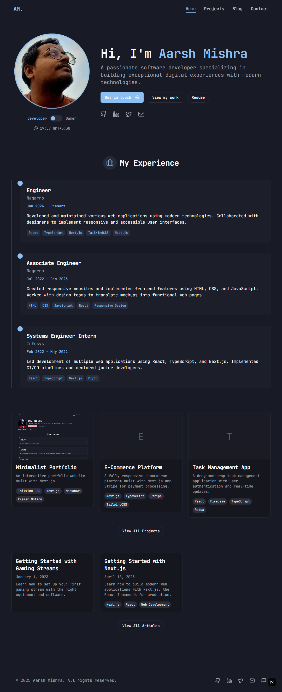

# LuC's Portfolio

A modern, responsive portfolio website built with Next.js, TypeScript, and Tailwind CSS. This portfolio features a unique dual persona concept - switching between developer and gamer profiles with distinct content and styling.



## Features

- 🌓 Dual persona toggle (Developer/Gamer)
- 🎨 Dark/Light mode with theme persistence
- 📱 Fully responsive design
- 📝 Blog with Markdown support
- 🚀 Projects showcase with filtering
- 🔍 SEO optimized
- ⚡ Fast performance with Next.js App Router

## Tech Stack

- **Framework**: [Next.js 14](https://nextjs.org/)
- **Language**: [TypeScript](https://www.typescriptlang.org/)
- **Styling**: [Tailwind CSS](https://tailwindcss.com/)
- **UI Components**: [shadcn/ui](https://ui.shadcn.com/)
- **Icons**: [Lucide Icons](https://lucide.dev/)
- **Content**: Markdown with [gray-matter](https://github.com/jonschlinkert/gray-matter)
- **Markdown Rendering**: [react-markdown](https://github.com/remarkjs/react-markdown)

## Getting Started

### Prerequisites

- Node.js 14or later
- npm or yarn

### Installation

1. Clone the repository:

```bash
git clone https://github.com/yourusername/custom-portfolio.git
cd custom-portfolio
```

2. Install dependencies:

```bash
npm install
# or
yarn install
```

3. Run the development server:

```bash
npm run dev
# or
yarn dev
```

4. Open [http://localhost:3000](http://localhost:3000) in your browser to see the result.

## Project Structure

```
├── app/                  # Next.js App Router pages
│   ├── blog/             # Blog pages
│   ├── projects/         # Projects pages
│   ├── layout.tsx        # Root layout
│   └── page.tsx          # Home page
├── components/           # Reusable UI components
├── content/              # Markdown content
│   ├── blog/             # Blog posts
│   └── projects/         # Project descriptions
├── lib/                  # Utility functions
├── public/               # Static assets
└── styles/               # Global styles
```

## Content Management

### Adding Blog Posts

Create a new markdown file in `content/blog/` with the following format:

```markdown
---
title: "Your Blog Post Title"
date: "YYYY-MM-DD"
excerpt: "A brief summary of your blog post"
tags: ["tag1", "tag2"]
image: "/path/to/image.jpg"  # Optional
---

Your blog post content in Markdown...
```

### Adding Projects

Create a new markdown file in `content/projects/` with the following format:

```markdown
---
title: "Project Title"
description: "Brief project description"
image: "/path/to/image.jpg"  # Optional
tags: ["tag1", "tag2"]
github: "https://github.com/yourusername/project"
demo: "https://demo-link.com"
featured: true  # Optional, for featured projects
order: 1  # Optional, for sorting
---

Detailed project description in Markdown...
```

## Persona Toggle

The site features a unique dual persona toggle that switches between Developer and Gamer profiles. Each persona has:

- Different color schemes
- Tailored content
- Unique social links
- Persona-specific projects and blog posts

## Customization

### Theme Colors

Edit the `tailwind.config.js` file to customize the color schemes for both light and dark modes, as well as for each persona.

### Personal Information

Update your personal information in the following files:
- `app/HomeContent.tsx` - Main profile information
- `app/layout.tsx` - Site metadata and SEO

## Deployment

This project can be easily deployed to Vercel:

```bash
npm run build
# or
vercel
```

For other platforms, follow the standard Next.js deployment process for that platform.

## License

This project is licensed under the MIT License - see the LICENSE file for details.

## Acknowledgements

- [Next.js](https://nextjs.org/) for the amazing React framework
- [shadcn/ui](https://ui.shadcn.com/) for the beautiful UI components
- [Tailwind CSS](https://tailwindcss.com/) for the utility-first CSS framework
- [Lucide Icons](https://lucide.dev/) for the clean SVG icons
