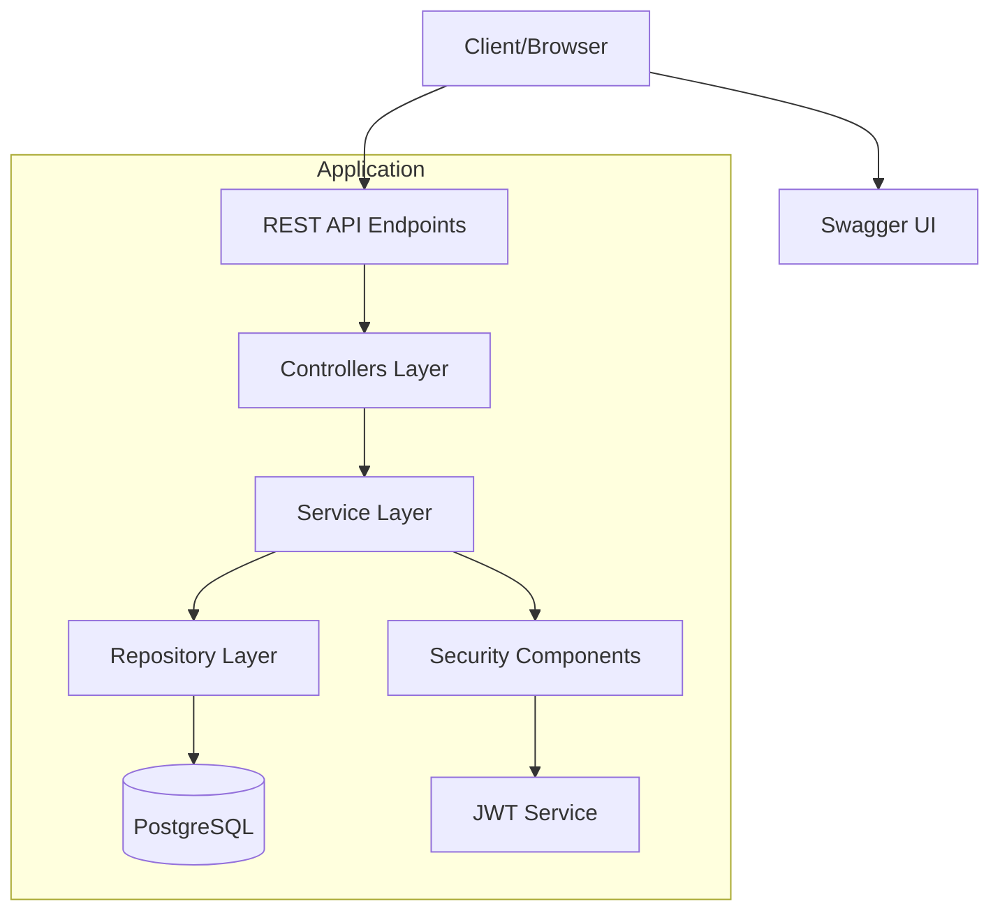
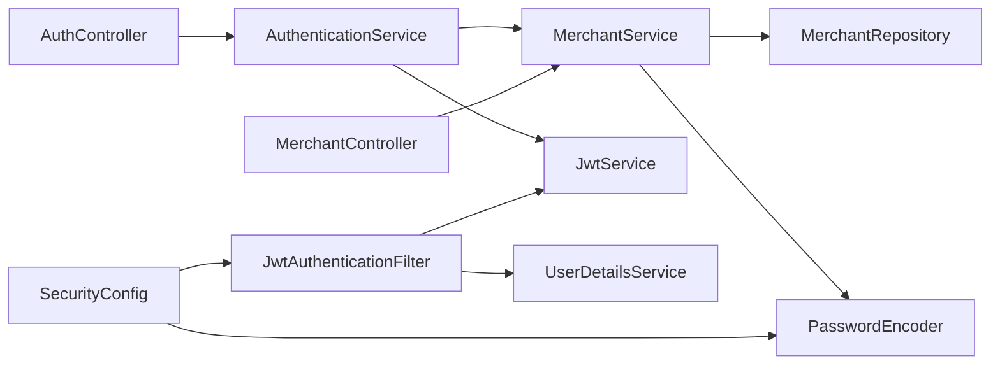

# Merchant Management API

A Spring Boot application for managing merchants with JWT authentication and PostgreSQL database.

## Features

- Merchant Authentication (Login/Register)
- JWT Token Based Security
- Complete Merchant CRUD Operations
- Data Validation
- PostgreSQL Database Integration
- Swagger API Documentation
- Password Encryption

## Prerequisites

- Java JDK 17
- Maven
- PostgreSQL

## Setup

1. Clone the repository:
```bash
git clone <repository-url>
cd merchant-api
```

2. Create PostgreSQL database:
```sql
CREATE DATABASE merchant_db;
```

3. Update database configuration in `src/main/resources/application.properties` if needed:
```properties
spring.datasource.url=jdbc:postgresql://localhost:5432/merchant_db
spring.datasource.username=postgres
spring.datasource.password=postgres
```

4. Build the project:
```bash
mvn clean install
```

5. Run the application:
```bash
mvn spring-boot:run
```

## API Documentation

Once the application is running, you can access:
- Swagger UI: http://localhost:8080/swagger-ui.html
- API Docs: http://localhost:8080/v3/api-docs

## Authentication

### Register New Merchant
```http
POST /api/v1/auth/register
```
Request body:
```json
{
  "businessName": "Example Business",
  "email": "example@business.com",
  "password": "securepassword",
  "phoneNumber": "1234567890",
  "address": "123 Business St",
  "businessType": "Retail",
  "registrationNumber": "REG123",
  "taxId": "TAX123"
}
```
Response: 
- Status: 201 CREATED
- Body: JWT token

### Login
```http
POST /api/v1/auth/login
```
Request body:
```json
{
  "email": "example@business.com",
  "password": "securepassword"
}
```
Response:
- Status: 200 OK
- Body: JWT token

## Protected Endpoints

All the following endpoints require JWT authentication. Add the JWT token to the Authorization header:
```
Authorization: Bearer your_jwt_token_here
```

### Get All Merchants
```http
GET /api/v1/merchants
```
Response:
- Status: 200 OK
- Body: Array of merchant objects

### Get Merchant by ID
```http
GET /api/v1/merchants/{id}
```
Response:
- Status: 200 OK
- Body: Merchant object
- Status: 404 Not Found (if merchant doesn't exist)

### Create New Merchant
```http
POST /api/v1/merchants
```
Request body:
```json
{
  "businessName": "New Business",
  "email": "new@business.com",
  "password": "securepassword",
  "phoneNumber": "1234567890",
  "address": "456 Business Ave",
  "businessType": "Service",
  "registrationNumber": "REG456",
  "taxId": "TAX456"
}
```
Response:
- Status: 201 CREATED
- Body: Created merchant object

### Update Merchant
```http
PUT /api/v1/merchants/{id}
```
Request body: Same as create merchant

Response:
- Status: 200 OK
- Body: Updated merchant object
- Status: 404 Not Found (if merchant doesn't exist)

### Delete Merchant
```http
DELETE /api/v1/merchants/{id}
```
Response:
- Status: 204 NO CONTENT
- Status: 404 Not Found (if merchant doesn't exist)

## Security Features

- JWT based authentication
- Password encryption using BCrypt
- Input validation
- Protected endpoints
- Stateless session management

## Using Swagger UI

1. Open Swagger UI at http://localhost:8080/swagger-ui.html
2. Register a new merchant using `/api/v1/auth/register`
3. Login using `/api/v1/auth/login` to get JWT token
4. Click the "Authorize" button at the top
5. Enter your JWT token as: `Bearer your_token_here`
6. Now you can test all protected endpoints

## Error Handling

The API includes comprehensive error handling for:
- Invalid input validation (400 Bad Request)
- Duplicate email addresses (409 Conflict)
- Entity not found (404 Not Found)
- Authentication failures (401 Unauthorized)
- Authorization failures (403 Forbidden)

## Contributing

1. Fork the repository
2. Create your feature branch (`git checkout -b feature/amazing-feature`)
3. Commit your changes (`git commit -m 'Add some amazing feature'`)
4. Push to the branch (`git push origin feature/amazing-feature`)
5. Open a Pull Request

## System Architecture



## Component Overview

### 1. Controllers Layer
Location: `src/main/java/com/merchant/api/controller/`
- **AuthController**: Handles authentication endpoints
  - `POST /api/v1/auth/register`
  - `POST /api/v1/auth/login`
- **MerchantController**: Manages merchant CRUD operations
  - `GET /api/v1/merchants`
  - `GET /api/v1/merchants/{id}`
  - `POST /api/v1/merchants`
  - `PUT /api/v1/merchants/{id}`
  - `DELETE /api/v1/merchants/{id}`

### 2. Service Layer
Location: `src/main/java/com/merchant/api/service/`
- **AuthenticationService**: Manages authentication logic
  - `register(Merchant)`: Creates new merchant and generates JWT
  - `login(email, password)`: Authenticates merchant and generates JWT
- **MerchantService**: Handles merchant business logic
  - `getAllMerchants()`: Retrieves all merchants
  - `getMerchantById(id)`: Finds merchant by ID
  - `createMerchant(Merchant)`: Creates new merchant
  - `updateMerchant(id, Merchant)`: Updates existing merchant
  - `deleteMerchant(id)`: Removes merchant
- **JwtService**: Manages JWT operations
  - `generateToken(UserDetails)`: Creates new JWT
  - `validateToken(token)`: Validates JWT
  - `extractUsername(token)`: Extracts user info from JWT

### 3. Repository Layer
Location: `src/main/java/com/merchant/api/repository/`
- **MerchantRepository**: Handles database operations
  - Extends `JpaRepository<Merchant, Long>`
  - Custom methods:
    - `findByEmail(String email)`
    - `existsByEmail(String email)`

### 4. Security Components
Location: `src/main/java/com/merchant/api/security/`
- **JwtAuthenticationFilter**: Intercepts and processes JWT tokens
- **SecurityConfig**: Configures security settings
  - JWT authentication
  - Password encoding
  - Endpoint authorization
  - CORS and CSRF settings

### 5. Models and DTOs
Location: `src/main/java/com/merchant/api/model/` & `src/main/java/com/merchant/api/dto/`
- **Merchant**: Main entity class
- **MerchantRegistrationRequest**: DTO for registration

## Dependency Flow




## License

This project is licensed under the MIT License - see the LICENSE file for details 

